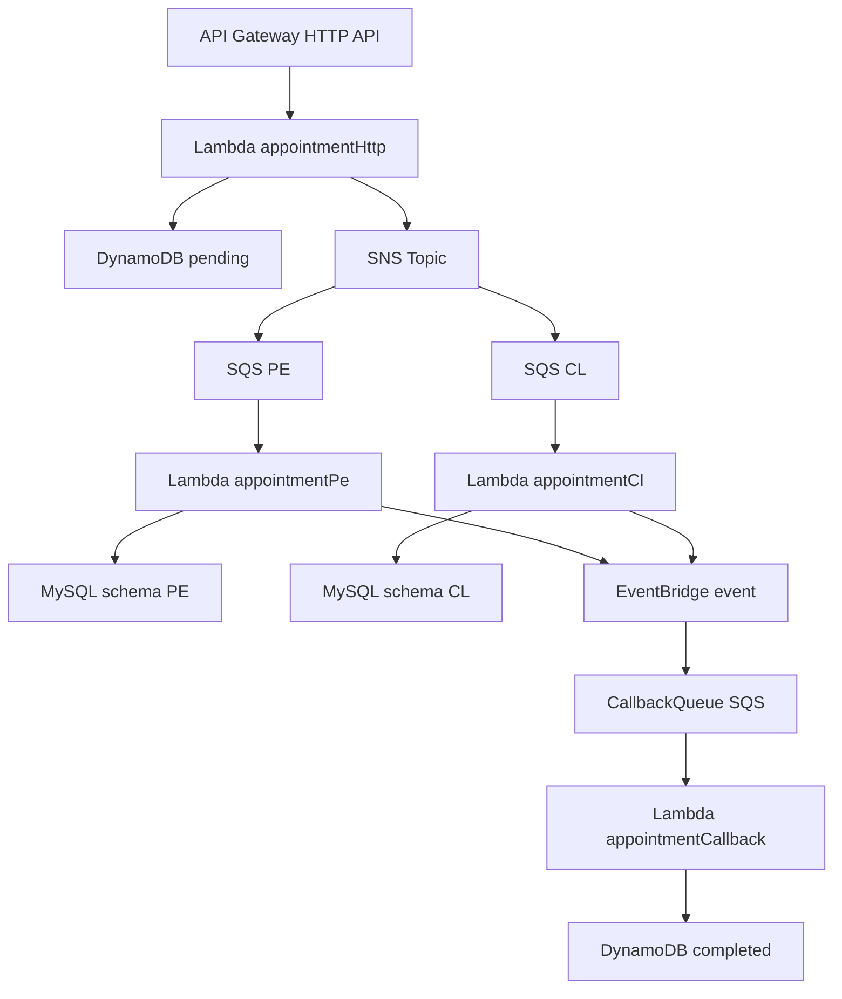

# 🚀 Rimac Appointments – Backend Serverless (Reto Técnico)

Este proyecto implementa un backend **100% serverless en AWS** para la gestión de agendamientos de citas.  
Fue desarrollado como respuesta a un reto técnico de Rimac, aplicando buenas prácticas de **arquitectura limpia**, **event‑driven**, **desacoplada** y **multi‑base de datos**.

---

# 🌱 1. Arquitectura General – Flujo Principal

### **POST /appointments**

1. Crea una cita en **DynamoDB** con estado `pending`.
2. Publica un evento en **SNS** con el campo `countryISO`.
3. SNS enruta el evento a la cola correcta según filtros:
   - 🇵🇪 `SqsPe` para Perú  
   - 🇨🇱 `SqsCl` para Chile  
4. Cada SQS dispara una Lambda distinta:
   - `appointmentPe` → inserta en MySQL (schema **mysql_pe**)  
   - `appointmentCl` → inserta en MySQL (schema **mysql_cl**)  
5. Cada Lambda publica un evento en **EventBridge** indicando que la cita fue procesada.  
6. EventBridge envía el evento a `CallbackQueue (SQS)`  
7. La Lambda `appointmentCallback` actualiza la cita en DynamoDB a `completed`.

---

# 🏗️ 2. Arquitectura Serverless (Diagrama)



---

# 🗂️ 3. Estructura del Proyecto

```
src/
 ├── application/
 │    ├── usecases/
 │    │     ├── CreateAppointment/
 │    │     ├── CompleteAppointment/
 │    │     └── ListAppointmentsByInsured/
 │    └── services/
 │          └── IEventPublisher.ts
 ├── domain/
 │    ├── entities/
 │    ├── events/
 │    └── repositories/
 ├── infrastructure/
 │    ├── aws/
 │    │    ├── dynamodb/
 │    │    ├── rds/
 │    │    ├── sqs/
 │    │    └── eventbridge/
 │    └── config/
 ├── interfaces/
 │    └── lambdas/
 └── tests/
      ├── unit/
      └── integration/
```

---

# ⚙️ 4. Endpoints

### **POST /appointments**
Crea una cita e inicia todo el flujo serverless.

### **GET /appointments/{insuredId}**
Retorna todas las citas del asegurado leyendo desde DynamoDB.

---

# ☁️ 5. Infraestructura AWS Utilizada

| Servicio | Uso |
|---------|-----|
| **API Gateway HTTP API** | Entrada HTTP |
| **AWS Lambda** | Lógica de negocio |
| **SNS** | Enrutamiento por país |
| **SQS** | Colas PE / CL / Callback |
| **EventBridge** | Eventos del sistema |
| **DynamoDB** | Estado de las citas |
| **RDS MySQL** | Persistencia por país |
| **SSM Parameter Store** | Variables seguras |

---

# 🔐 6. Parámetros SSM

Los parámetros se crean manualmente:

```
/rimac/db/pe/host
/rimac/db/pe/user
/rimac/db/pe/password
/rimac/db/pe/name

/rimac/db/cl/host
/rimac/db/cl/user
/rimac/db/cl/password
/rimac/db/cl/name
```

---

# 🧪 7. Tests Unitarios

Los tests se encuentran en:

```
tests/unit/
```

Incluyen:
- CreateAppointmentUseCase  
- CompleteAppointmentUseCase  
- ListAppointmentsByInsuredUseCase  

Ejecutar:

```bash
npm test
```

---

# 🚀 8. Despliegue

```bash
npx serverless deploy --stage dev
```

---

# 📦 9. Tecnologías

- TypeScript  
- AWS Lambda  
- DynamoDB  
- SNS + SQS  
- EventBridge  
- RDS MySQL  
- Serverless Framework (esbuild)  
- Jest  

---

# 🧑‍💻 10. Autor

Proyecto desarrollado como solución a un reto técnico, con foco en arquitectura limpia y buenas prácticas serverless.
